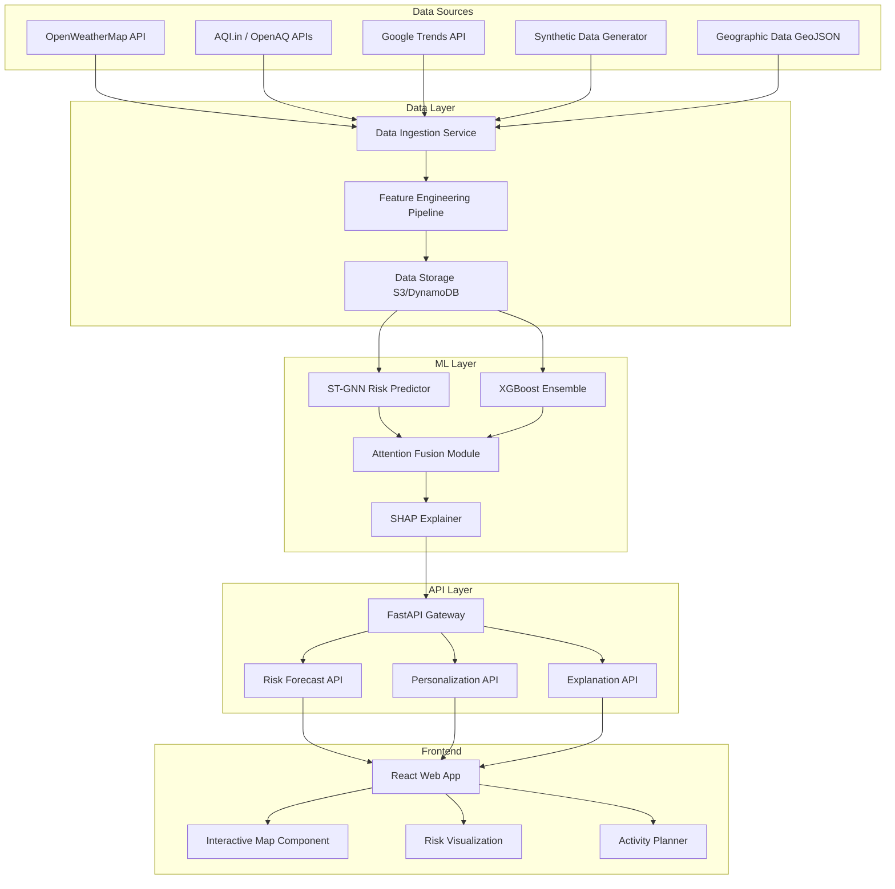

# Design Document: RogVaani - AI-Powered Hyperlocal Health Risk Forecasting System

## Overview

RogVaani is a comprehensive AI-powered health risk forecasting system designed for the Amazon India hackathon. The system leverages advanced spatiotemporal machine learning techniques to predict hyperlocal health risks 3-7 days in advance, combining multiple data sources through sophisticated fusion algorithms. The architecture emphasizes explainable AI, real-time performance, and scalable cloud deployment on AWS.

The system addresses three primary risk categories: airborne (respiratory infections, air pollution-related), waterborne (gastrointestinal diseases, contamination events), and vector-borne (mosquito, tick-borne diseases) health risks. By integrating weather data, air quality indices, synthetic health incident data, and search trends, RogVaani provides personalized risk assessments and actionable precautions based on user activities and locations.

## Architecture

### High-Level System Architecture



### AWS Cloud Architecture

The system will be deployed on AWS using the following services:
- **API Gateway + Lambda**: Serverless API endpoints for scalability
- **SageMaker**: ML model training and inference endpoints
- **S3**: Data storage for raw data, processed features, and model artifacts
- **DynamoDB**: Real-time data storage for user sessions and cached predictions
- **CloudWatch**: Monitoring and logging
- **EventBridge**: Scheduled data ingestion triggers
- **ElastiCache**: Caching layer for frequently accessed predictions

## Components and Interfaces

### Data Ingestion Service

**Purpose**: Orchestrates data collection from multiple external sources and synthetic data generation.

**Key Components**:
- **Weather Data Collector**: Interfaces with OpenWeatherMap API for meteorological data
- **Air Quality Collector**: Fetches AQI data from multiple sources (AQI.in, OpenAQ)
- **Search Trends Collector**: Retrieves health-related search patterns from Google Trends
- **Synthetic Data Generator**: Creates realistic health incident data with spatiotemporal patterns

**Interface**:
```python
class DataIngestionService:
    def collect_weather_data(self, coordinates: List[Tuple[float, float]], 
                           start_date: datetime, end_date: datetime) -> WeatherData
    def collect_aqi_data(self, coordinates: List[Tuple[float, float]], 
                        start_date: datetime, end_date: datetime) -> AQIData
    def generate_synthetic_health_data(self, region: str, 
                                     time_period: DateRange) -> HealthIncidentData
    def schedule_data_collection(self, frequency: str = "6h") -> None
```

### Feature Engineering Pipeline

**Purpose**: Transforms raw data into spatiotemporal features suitable for ML models.

**Key Features**:
- **Temporal Feature Extraction**: Creates time-series features including seasonality, trends, and lag variables
- **Spatial Feature Engineering**: Generates geographic features including distance matrices, neighborhood effects, and spatial autocorrelation
- **Cross-Modal Feature Fusion**: Combines features from different data modalities using attention mechanisms

**Interface**:
```python
class FeatureEngineeringPipeline:
    def create_temporal_features(self, time_series_data: TimeSeriesData) -> TemporalFeatures
    def create_spatial_features(self, geographic_data: GeoData) -> SpatialFeatures
    def fuse_multimodal_features(self, features: List[FeatureSet]) -> FusedFeatures
    def prepare_training_data(self, features: FusedFeatures, 
                            labels: HealthRiskLabels) -> TrainingDataset
```

### Spatiotemporal Risk Predictor

**Purpose**: Core ML component implementing ST-GNN architecture for disease spread prediction.

**Architecture Details**:
Based on research findings, the system implements a hybrid approach combining:
- **Graph Attention Networks (GAT)**: Capture spatial relationships between geographic regions
- **Gated Recurrent Units (GRU)**: Model temporal dynamics and disease progression
- **Multi-scale Processing**: Handle both local (ward-level) and regional (city-level) patterns

**Model Architecture**:
```python
class STGNNPredictor:
    def __init__(self, num_regions: int, feature_dim: int, hidden_dim: int):
        self.spatial_attention = GATv2Layer(feature_dim, hidden_dim)
        self.temporal_gru = GRULayer(hidden_dim, hidden_dim)
        self.risk_classifier = MultiTaskHead(hidden_dim, num_risk_types=3)
        
    def forward(self, spatial_features: Tensor, 
                temporal_features: Tensor, 
                adjacency_matrix: Tensor) -> RiskPredictions
```

**Interface**:
```python
class RiskPredictor:
    def predict_risks(self, location: Coordinates, 
                     forecast_days: int = 7) -> RiskForecast
    def batch_predict(self, locations: List[Coordinates], 
                     forecast_days: int = 7) -> List[RiskForecast]
    def get_confidence_intervals(self, predictions: RiskForecast) -> ConfidenceIntervals
```

### Data Fusion Module

**Purpose**: Combines predictions from multiple models and data sources using attention mechanisms.

**Fusion Strategy**:
- **Ensemble Learning**: Combines ST-GNN and XGBoost predictions using weighted averaging
- **Attention-Based Fusion**: Dynamically weights different data sources based on their relevance and quality
- **Uncertainty Quantification**: Provides confidence intervals for all predictions

**Interface**:
```python
class DataFusionModule:
    def fuse_predictions(self, stgnn_pred: Prediction, 
                        xgboost_pred: Prediction, 
                        data_quality_scores: QualityScores) -> FusedPrediction
    def calculate_attention_weights(self, data_sources: List[DataSource]) -> AttentionWeights
    def quantify_uncertainty(self, predictions: List[Prediction]) -> UncertaintyEstimate
```

### Explainable AI Module

**Purpose**: Provides interpretable explanations for risk predictions using SHAP and LIME techniques.

**Explanation Methods**:
- **SHAP Values**: Global feature importance across all predictions
- **LIME**: Local explanations for individual predictions
- **Causal Analysis**: Identifies key contributing factors for risk emergence

**Interface**:
```python
class ExplanationModule:
    def generate_shap_explanation(self, prediction: RiskPrediction, 
                                 features: FeatureSet) -> SHAPExplanation
    def generate_lime_explanation(self, prediction: RiskPrediction, 
                                 instance: DataInstance) -> LIMEExplanation
    def get_top_risk_factors(self, explanation: Explanation, 
                           top_k: int = 3) -> List[RiskFactor]
```

### Recommendation Engine

**Purpose**: Maps predicted risks to actionable precautions based on WHO/CDC guidelines and user activity context.

**Recommendation Logic**:
- **Risk-Activity Mapping**: Associates specific activities with relevant risk types
- **Guideline Integration**: Incorporates WHO and CDC prevention guidelines
- **Personalization**: Customizes recommendations based on user profile and planned activities

**Interface**:
```python
class RecommendationEngine:
    def generate_precautions(self, risk_forecast: RiskForecast, 
                           activities: List[Activity]) -> PrecautionList
    def personalize_recommendations(self, base_recommendations: PrecautionList, 
                                  user_profile: UserProfile) -> PersonalizedPrecautions
    def get_alternative_suggestions(self, high_risk_activity: Activity) -> List[Alternative]
```

## Data Models

### Core Data Structures

```python
@dataclass
class Coordinates:
    latitude: float
    longitude: float
    ward_name: Optional[str] = None

@dataclass
class RiskLevel:
    risk_type: RiskType  # AIRBORNE, WATERBORNE, VECTOR_BORNE
    level: float  # 0.0 to 1.0
    confidence: float  # 0.0 to 1.0
    timestamp: datetime

@dataclass
class RiskForecast:
    location: Coordinates
    forecast_period: DateRange
    risk_levels: List[RiskLevel]
    contributing_factors: List[str]
    confidence_intervals: Dict[RiskType, Tuple[float, float]]

@dataclass
class Activity:
    activity_type: ActivityType  # OUTDOOR_LEISURE, DINING, INDOOR_GATHERING
    location: Coordinates
    planned_time: datetime
    duration_hours: float
    participant_count: Optional[int] = None

@dataclass
class Precaution:
    precaution_id: str
    description: str
    risk_types: List[RiskType]
    activity_types: List[ActivityType]
    priority: PriorityLevel  # HIGH, MEDIUM, LOW
    source_guideline: str  # WHO, CDC, etc.

@dataclass
class HealthIncident:
    incident_id: str
    location: Coordinates
    incident_type: RiskType
    severity: float
    timestamp: datetime
    affected_population: int
    is_synthetic: bool = True
```

### Database Schema

**DynamoDB Tables**:
- **Predictions**: Cached risk forecasts with TTL
- **UserSessions**: User activity data and preferences
- **HealthIncidents**: Synthetic health incident records
- **GeographicBoundaries**: Ward and district boundary data

**S3 Data Organization**:
```
rogvaani-data/
├── raw-data/
│   ├── weather/YYYY/MM/DD/
│   ├── aqi/YYYY/MM/DD/
│   └── synthetic-health/YYYY/MM/DD/
├── processed-features/
│   ├── temporal-features/
│   └── spatial-features/
└── model-artifacts/
    ├── stgnn-models/
    └── xgboost-models/
```

## Correctness Properties

*A property is a characteristic or behavior that should hold true across all valid executions of a system—essentially, a formal statement about what the system should do. Properties serve as the bridge between human-readable specifications and machine-verifiable correctness guarantees.*

Before defining the correctness properties, I need to analyze the acceptance criteria from the requirements to determine which ones are testable as properties.

### Converting EARS to Properties

Based on the prework analysis, I'll convert the testable acceptance criteria into comprehensive correctness properties, consolidating related properties to eliminate redundancy:

**Property 1: Risk Forecast Completeness**
*For any* valid coordinate and date range input, the Risk_Forecaster should generate predictions that include all three risk types (airborne, waterborne, vector-borne) with confidence intervals for the specified 3-7 day forecast period
**Validates: Requirements 1.1, 1.2, 1.3, 1.4**

**Property 2: Model Performance Standards**
*For any* synthetic validation dataset, the Risk_Forecaster should achieve minimum 70% accuracy across all risk type predictions
**Validates: Requirements 1.5**

**Property 3: Multi-Source Data Collection**
*For any* scheduled data collection cycle, the Data_Ingestion_Service should successfully fetch data from all configured sources (OpenWeatherMap, AQI.in/OpenAQ, Google Trends) and handle failures gracefully using cached data
**Validates: Requirements 2.1, 2.2, 2.3, 2.5**

**Property 4: Synthetic Data Quality**
*For any* generated synthetic health incident dataset, the data should exhibit realistic seasonal patterns, spatial correlation for outbreaks, and include all required data types (health incidents, water quality, vector breeding sites)
**Validates: Requirements 2.4, 9.1, 9.2, 9.3, 9.5**

**Property 5: Data Update Frequency**
*For any* 6-hour monitoring period, the Data_Ingestion_Service should update all data sources at least once within the specified interval
**Validates: Requirements 2.6**

**Property 6: Interactive Map Functionality**
*For any* user map interaction, the system should provide appropriate responses including heatmap data for viewing, detailed risk breakdowns for location selection, and support for multiple zoom levels from city-wide to hyperlocal (1-2 km radius)
**Validates: Requirements 3.1, 3.3, 3.5**

**Property 7: Activity-Based Personalization**
*For any* user activity input (outdoor leisure, dining, indoor gatherings), the Recommendation_Engine should generate personalized precaution lists based on activity-specific risk exposure and provide location-specific recommendations for multi-location activities
**Validates: Requirements 4.1, 4.2, 4.3**

**Property 8: Risk-Based Alternative Suggestions**
*For any* high-risk activity scenario, the system should suggest alternative timing or locations when risk levels exceed safe thresholds
**Validates: Requirements 4.4**

**Property 9: Guideline-Based Recommendations**
*For any* generated precaution, the recommendation should be traceable to WHO or CDC guidelines and emphasize prevention focus
**Validates: Requirements 4.5, 11.2**

**Property 10: Comprehensive Explainability**
*For any* risk prediction, the Explanation_Module should provide feature importance rankings, identify the top 3 contributing factors for each risk type, and use SHAP or LIME techniques for explanation generation
**Validates: Requirements 5.1, 5.2, 5.3, 5.5**

**Property 11: Uncertainty Communication**
*For any* low-confidence prediction, the system should clearly communicate uncertainty levels in both the prediction and explanation components
**Validates: Requirements 5.4**

**Property 12: API Performance and Compliance**
*For any* API request, the system should respond within 2 seconds for 95% of requests, use proper RESTful endpoints with correct HTTP status codes, and handle both GET and POST requests appropriately
**Validates: Requirements 6.1, 6.2, 6.3, 6.5, 10.1**

**Property 13: Data Processing Pipeline Integrity**
*For any* new data input, the system should process it through feature engineering pipelines, create appropriate spatiotemporal features, and maintain separation between batch training and real-time inference pipelines
**Validates: Requirements 7.1, 7.2, 7.3, 7.5**

**Property 14: Automated Model Management**
*For any* detected model performance degradation, the system should automatically trigger retraining workflows
**Validates: Requirements 7.4**

**Property 15: User Interface Data Completeness**
*For any* user interface interaction, the system should provide complete data for activity planning, explanation displays, and PDF export functionality
**Validates: Requirements 8.2, 8.3, 8.4**

**Property 16: Medical Compliance and Disclaimers**
*For any* health information display, the system should include appropriate medical disclaimers, communicate synthetic data limitations, and never make diagnostic claims
**Validates: Requirements 8.5, 11.1, 11.3, 11.4, 11.5**

**Property 17: Error Handling and Resilience**
*For any* system error or external API failure, the system should log detailed error information, gracefully degrade functionality, and notify users of reduced accuracy when applicable
**Validates: Requirements 10.2, 10.4**

**Property 18: Data Separation and Validation**
*For any* model training process, the system should use separate synthetic datasets for training and testing with no data overlap
**Validates: Requirements 9.4**

**Property 19: Geographic Data Integration**
*For any* location-based query, the system should use accurate ward boundary GeoJSON data for Bangalore, support coordinate-based queries, and provide location names with administrative boundaries at hyperlocal precision
**Validates: Requirements 12.1, 12.2, 12.3, 12.4, 12.5**

## Error Handling

### Error Categories and Strategies

**External API Failures**:
- **Weather API Unavailable**: Fall back to cached weather data with timestamp warnings
- **AQI API Failures**: Use alternative AQI sources or interpolate from nearby stations
- **Search Trends Unavailable**: Continue predictions without search trend features, with reduced confidence

**Model Inference Errors**:
- **Model Loading Failures**: Implement model versioning with automatic rollback to previous stable version
- **Prediction Timeouts**: Return cached predictions with staleness indicators
- **Invalid Input Data**: Provide clear error messages with input validation guidance

**Data Quality Issues**:
- **Missing Spatial Data**: Use spatial interpolation techniques to fill gaps
- **Temporal Data Gaps**: Apply time-series imputation methods
- **Synthetic Data Generation Failures**: Fall back to historical synthetic patterns

**System Resource Constraints**:
- **Memory Limitations**: Implement batch processing for large prediction requests
- **CPU Overload**: Queue requests with priority-based processing
- **Storage Limits**: Implement data retention policies with automatic cleanup

### Error Response Format

```json
{
  "error": {
    "code": "PREDICTION_TIMEOUT",
    "message": "Risk prediction timed out, returning cached results",
    "details": {
      "cached_timestamp": "2024-01-15T10:30:00Z",
      "reduced_accuracy": true,
      "retry_after": 300
    }
  },
  "data": {
    "predictions": [...],
    "confidence_reduction": 0.15
  }
}
```

## Testing Strategy

### Dual Testing Approach

The RogVaani system requires comprehensive testing using both unit tests and property-based tests to ensure correctness across all components:

**Unit Testing Focus**:
- **API Endpoint Testing**: Verify specific request/response patterns for each endpoint
- **Data Validation**: Test input validation logic with specific valid/invalid examples
- **Error Handling**: Test specific error scenarios and recovery mechanisms
- **Integration Points**: Test connections between system components with known data
- **Edge Cases**: Test boundary conditions like extreme coordinates, date ranges, and risk levels

**Property-Based Testing Focus**:
- **Universal Correctness**: Verify properties hold across all possible inputs using randomized testing
- **Data Pipeline Integrity**: Test feature engineering and model inference with generated data
- **API Consistency**: Verify API contracts hold for all valid input combinations
- **Performance Characteristics**: Test response time and accuracy requirements across input distributions
- **Compliance Requirements**: Verify medical disclaimers and data limitations are always present

### Property-Based Test Configuration

**Testing Framework**: Use Hypothesis (Python) for property-based testing with minimum 100 iterations per test
**Test Tagging**: Each property test must reference its design document property using the format:
```python
# Feature: rogvaani, Property 1: Risk Forecast Completeness
@given(coordinates=valid_coordinates(), date_ranges=forecast_date_ranges())
def test_risk_forecast_completeness(coordinates, date_range):
    # Test implementation
```

**Test Categories**:
- **Model Properties**: Test ML model behavior and performance characteristics
- **API Properties**: Test REST API contracts and response formats
- **Data Properties**: Test data processing and synthetic data generation
- **Integration Properties**: Test end-to-end system behavior

### Testing Infrastructure

**Synthetic Data for Testing**:
- Generate realistic test datasets that mirror production data patterns
- Create edge case scenarios for robust testing
- Maintain separate test data that doesn't overlap with training data

**Mock Services**:
- Mock external APIs (OpenWeatherMap, AQI.in) for reliable testing
- Simulate API failures and degraded performance scenarios
- Create controlled test environments for reproducible results

**Performance Testing**:
- Load testing with simulated concurrent users
- Response time monitoring across different query types
- Memory and CPU usage profiling during peak loads

**Continuous Integration**:
- Automated test execution on code changes
- Property test results tracking and regression detection
- Model performance monitoring and alerting

The testing strategy ensures that RogVaani maintains high reliability and accuracy while meeting all functional and non-functional requirements through comprehensive validation of both specific examples and universal properties.